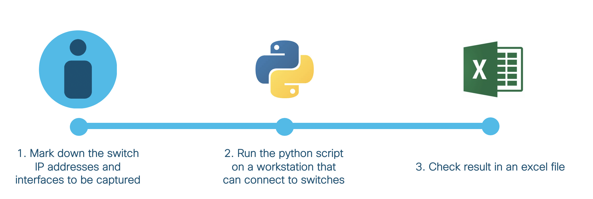
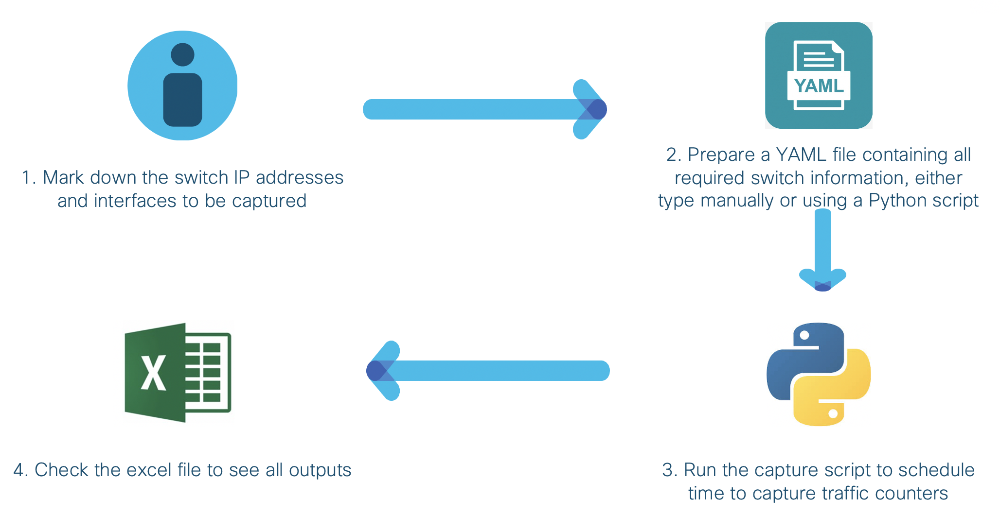

# Traffic Counter Capture Automation

A script that can be scheduled to capture traffic counters from switches, particularly under "show interface <interface>" command.

---

The following diagram describes the high-level workflow.






## Contacts
* Alvin Lau (alvlau@cisco.com)
* Nishant Hooda (nhooda@cisco.com)
* Swati Singh (swsingh3@cisco.com)


## Solution Components
* Catalyst Switches
* Python 3.7


## Prerequisite
- **SSH enabled on switches** - this script is using Netmiko to connect to switches. Netmiko is based on SSH connection.


## Installation

1. Clone this repository by `git clone <this repo>`.

2. Optionally, create a Python 3 virtual environment.
```
python3 -m venv venv
source venv/bin/activate
```

3. Install the dependencies.
```
pip install -r requirement.txt
```

4. Prepare the switches.yaml file and capture traffic counters. There are two ways:
   - Input all the switch username, password, IP address and interfaces to be captured on CLI
   - Follow along the questions to schedule capture
   ```
   python app.py
   ```
   - Alternatively, using sample.yaml as a reference of data format, type your own switches.yaml
   - Start capturing using capture.py
   ```
   python capture.py
   ```

5. Initially there is a blank traffic.xlsx file. All captured traffic counters are appended to this excel file and grouped by switches.


## License
Provided under Cisco Sample Code License, for details see [LICENSE](./LICENSE)


## Code of Conduct
Our code of conduct is available [here](./CODE_OF_CONDUCT.md)


## Contributing
See our contributing guidelines [here](./CONTRIBUTING.md)
